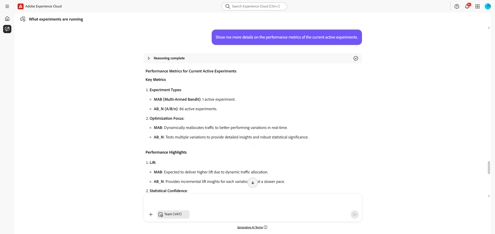

# Experimentationsagent

>[!AVAILABILITY]
>
>Experimentationsagenten är tillgänglig för alla kunder som har tillgång till AI Assistant. Du behöver dock följande behörigheter för att kunna använda Experimentationsagentfunktionerna fullt ut.
>
>**Visa vyexperiment**: Med den här behörigheten kan du använda Experimentationsagenten för att visa insikter i experimentet direkt i AI Assistant.
>
>**Hantera experimentmetadata**: Med den här behörigheten kan du använda experimenteringsagenten för att skapa nya experiment direkt i AI-assistenten.

## Översikt

**Experimentationsagenten** är ett AI-drivet verktyg som moderniserar hur du kan köra och hantera digitala experiment på webbplatser, i e-postmeddelanden, push-meddelanden och i program. **Experimentationsagenten** bygger på Adobe Experience Platform AI-plattformen och experimenteringsverktygen och hjälper dig att köra experiment mer effektivt, ordna affärsmål och generera åtgärdbara insikter, framhäva vad som fungerade, vad som inte gjorde det och var du ska experimentera härnäst.

Som en del av Experimentation Accelerator-funktionen tillhandahåller agenten:

* **Prestanda**: en tydlig vy av vad som hände i experimentet

* **Insikter**: en förklaring till varför resultatet inträffade

* **Affärsmöjligheter**: vägledning om nästa åtgärd som ska vidtas

## Användningsfall

Experimentationsagenten förbättrar varje fas i experimenteringsarbetsflödet genom att analysera resultat, tolka innehåll och föreslå nästa steg.

Funktionerna kan grupperas i fem nyckelfunktioner:

* **Experimentsammanfattning**

  Ge en tydlig, icke-teknisk översikt av experimentresultaten för berörda parter.

* **Innehållsanalys**

  Undersök de budskap eller kreativa element som finns i behandlingarna för att förstå varför vissa överträffar andra.

* **Attributidentifiering**

  Kategorisera behandlingarna utifrån deras huvudattribut, t.ex. teman, toner, format och koppla dessa attribut till konverteringsresultatet.

* **Rekommendationsgenerering**

  Föreslå nya behandlingar eller justeringar att testa, baserat på insikter från tidigare experiment.

* **Affärsmöjligheter**

  Identifiera bredare områden eller nya vinklar för experimenterande för att identifiera outnyttjad potential.

## Funktioner inom och utanför omfång

### **I scope**

Följande funktioner stöds för närvarande:

* Prestanda
* Insikter
* Möjligheter

### **Odefinierat**

Följande funktioner stöds för närvarande inte:

* Skapa och redigera experiment
* Använda flera mätvärden för att rapportera användningsfall

## Exempelfrågor

Här följer ett antal exempelfrågor som hjälper dig att komma igång med Experimentation Agent:

### Allmänna frågor

| Fråga |
|-|
| Vilka experiment körs? |
| Vilka experiment körs för `<campaign name>`? |
| Vilka experiment har startat den senaste månaden? |
| Hur många experiment tog slut det senaste året? |
| Vilka experiment har pausats/stoppats/etc.? |
| Vilka gemensamma mönster har framkommit vid de senaste testerna? |
| Hur lång är den genomsnittliga tiden för experiment under det senaste kvartalet? |

### Prestandafrågor

| Fråga |
|-|
| Vilken behandling leder för min `<experiment name>`? |
| Vad är höjden på `<experiment name>`? |
| Vilka experiment gav statistiskt signifikanta resultat? |
| Vilka experiment hade den bästa konverteringsgraden? |

### Insikter - frågor

| Fråga |
|-|
| Vad är `<experiment name>`-testning?? |
| Vad lärde vi oss av `<experiment name>`? |
| Kan du berätta varför behandling A vann? |
| Vilka teman är trenderna när det gäller att vinna varianter? |
| Vilka gemensamma mönster har framkommit vid de senaste testerna? |
| Har något oväntat hänt i `<experiment name>`? |

### Frågor om affärsmöjligheter

| Fråga |
|-|
| Vad rekommenderar du att jag gör efter det här experimentet? |
| Går det att förbättra `<experiment name>`? |
| Vilka möjligheter blev tydligare efter `<experiment name>`? |
| Vad kan jag testa härnäst för att bevisa hypotesen från `<experiment name>`? |
| Vilka ytterligare användningsfall ska jag implementera? |
