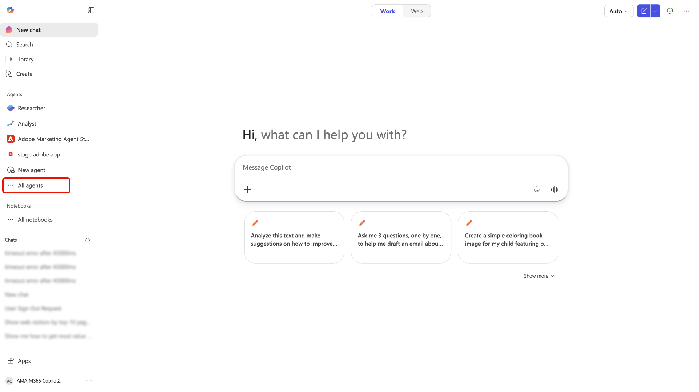
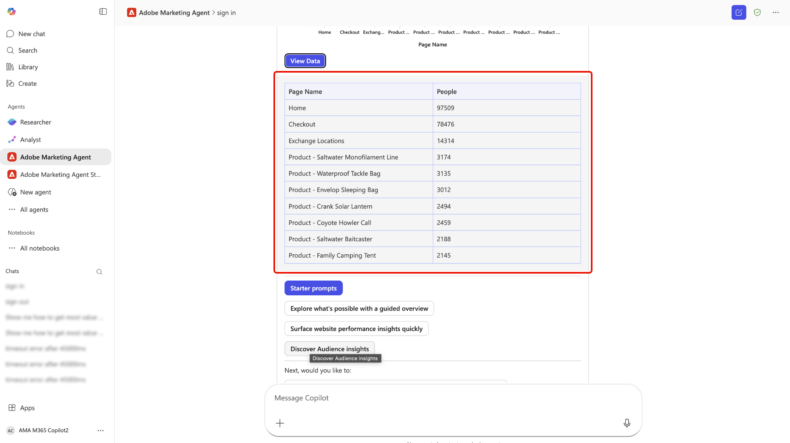

# Adobe Marketing Agent för [!DNL Microsoft 365 Copilot]

Adobe Marketing Agent för [!DNL Microsoft 365 Copilot] är ett AI-baserat verktyg som ansluter Adobe Experience Platform direkt till [!DNL Microsoft 365 Copilot]. Med den här agenten kan du ställa frågor om naturliga språk i [!DNL Microsoft 365]-program som [!DNL Teams], [!DNL Word], [!DNL Powerpoint] och [!DNL Excel] för att omedelbart hämta marknadsföringsinsikter från Experience Platform utan att avbryta ditt arbetsflöde. Samma agent är tillgänglig i alla dessa appar och din chatthistorik med Adobe Marketing Agent överförs så att du kan starta forskning i [!DNL Copilot] i [!DNL Teams] och fortsätta konversationen i [!DNL Word] eller [!DNL Powerpoint] medan du gör ett utkast eller granskar en presentation.

Med Adobe Marketing Agent för [!DNL Microsoft 365 Copilot] kan marknadsföringsansvariga, analytiker, insikter och intressenter:

- Snabbare, datadrivna marknadsföringsbeslut.
- Minska tiden för att växla mellan verktyg.
- Förenkla tillgången till målgrupps- och reseinsikter mellan olika team.

## Så här fungerar agenten

>[!IMPORTANT]
>
>Adobe Marketing Agent för [!DNL Microsoft 365 Copilot] stöder Experience Platform Operational Insights, Customer Journey Analytics Data Insights, Audience Agent och Journey Agent.

Adobe Marketing Agent för [!DNL Microsoft 365 Copilot] erbjuder en integrerad upplevelse mellan Experience Platform och [!DNL Microsoft 365]-program:

- Adobe Marketing Agent visas som en agent i [!DNL Microsoft 365 Copilot], inklusive i [!DNL Teams], [!DNL Word], [!DNL Powerpoint] och [!DNL Excel].
- Logga in med ditt Adobe-konto och välj den datamiljö (sandlåda, datavy) som du vill använda.

### Dataåtkomst och behörigheter

De svar du får speglar de **data- och åtkomstnivåer** som är kopplade till din Adobe-identitet. Det du kan fråga och se är samma som det du är berättigad till i Experience Platform och dess tillhörande lösningar. Adobe Marketing Agent **ärver** dessa behörigheter och **inte** kräver en separat behörighetsinställning för [!DNL Microsoft 365]-integreringen. För underliggande Experience Platform AI Assistant-funktioner och andra Adobe AI-agenter ändras inte **behörighetskraven** från att använda dessa funktioner i Experience Platform.

Agenten ansluter din [!DNL Microsoft 365]-instans till Experience Platform och dess associerade program (Real-Time CDP, Adobe Journey Optimizer och Customer Journey Analytics). Med den här integreringen kan du sedan använda Experience Platform AI Assistant och agenter för att hämta relevanta insikter direkt till din [!DNL Microsoft 365]-instans. Svaren som returneras i din [!DNL Microsoft 365]-instans presenteras som konversationstexter och naturliga språktexter, tabeller och datavisualiseringar. Dessutom finns det stöd för uppföljningsfrågor och undersökningar i samma [!DNL Copilot]-chatt.

## Viktiga användningsexempel och exempelscenarier

| Använd skiftläge | Beskrivning |
| --- | --- |
| Få operativa insikter om målgrupper och kundresor | Med Adobe Marketing Agent kan ni enkelt ta fram driftsinsikter för alla era målgrupper och kundresor. Ni kan identifiera vilka målgrupper som är störst eller mest engagerade, så att ni kan prioritera var ni ska fokusera. Ni kan se vilka kundresor som för närvarande är aktiva och lära er hur de fungerar, vilket hjälper er att identifiera optimeringsmöjligheter. Med agenten kan ni också spåra hur olika segment växer eller krymper över tiden, så att ni kan reagera på förändringar i publikens dynamik efterhand som de inträffar. |
| Använd datavisualisering för att bättre analysera kundresor och kampanjer | Ni kan granska reseprestanda och bortfall, jämföra kampanjresultat över tid och förstå vilka kontaktytor som driver konverteringar. Dessutom kan ni generera visuella rapporter om kampanjresultat och jämföra dessa i olika kanaler, regioner eller under olika tidsperioder. Du kan också utforska trender utan att behöva skapa frågor eller kontrollpaneler manuellt. |
| Möjliggör samarbete och beslutsfattande | Använd förslag för att utforska målgrupper, kampanjer och webbtrafik. Utnyttja det naturliga språkgränssnittet för enklare inlärning av Experience Platform- och Customer Journey Analytics-koncept. Dessutom kan du dela insikter om [!DNL Teams]-kanaler eller chattar under planeringsmöten. Ni kan också använda Adobe Marketing Agent för att besvara ad hoc-frågor i realtid när ni granskar planer eller modeller, så att era intressenter kan anpassa sig till samma uppsättning mätvärden och definitioner. |

## Förutsättningar

Innan du kan använda Adobe Marketing Agent för [!DNL Microsoft 365 Copilot] måste du se till att du har följande:

- [!DNL Microsoft 365] med [!DNL Microsoft Teams] eller [!DNL Microsoft Copilot Chat].
- Experience Platform och minst en av följande: Real-Time CDP, Adobe Journey Optimizer och/eller Customer Journey Analytics.
- Tillstånd till Experience Platform Agent Orchestrator och dess ombud.
- Tillgång till din organisations Adobe Experience Cloud-konto (inloggning och produkträttigheter) för de lösningar och data du använder. Kontakta Adobe-administratören om du inte har åtkomst till Adobe.

## Aktivera agenten för din organisation {#enable-the-agent-for-your-organization}

Slutanvändare kan bara använda Adobe Marketing Agent efter att det har gjorts tillgängligt i din [!DNL Microsoft 365]-klient. **Arbeta med din [!DNL Microsoft 365] Copilot-administratör** (eller motsvarande administratör för Copilot-agenter i din organisation) för att aktivera åtkomst och tilldela agenten efter behov.

Vanliga resultat efter administratörskonfiguration är:

- Du kan öppna **[!DNL Agent Store]** i [!DNL Teams], söka efter **[!DNL Adobe Marketing Agent]** i din lista över agenter och välja **[!DNL Add]** för att bifoga den till dina Copilot-agenter.
- Din Copilot-administratör kan också **publicera** agenten till alla i organisationen eller till specifika grupper så att användarna inte behöver lägga till den individuellt.

Administratörssteg och principalternativ i [!DNL Microsoft 365] Admin Center finns i [Hantera agenter för Microsoft 365 Copilot](https://learn.microsoft.com/en-us/microsoft-365-copilot/extensibility/manage) i Microsoft-dokumentationen.

## Kom igång

När din organisation har aktiverat agenten (se [Aktivera agenten för din organisation](#enable-the-agent-for-your-organization)) går du till [!DNL Microsoft 365 Copilot] i det program du väljer och väljer **[!DNL All Agents]** via den vänstra navigeringen.

Leta reda på kortet för [!DNL Adobe Marketing Agent] eller använd sökfältet för att leta efter agenten manuellt. När du har fått agenten väljer du kortet.

Använd popup-fönstret för att lära dig mer om agenten. Välj **[!DNL Add]** när du är klar.

Kontrollpanelen [!DNL Microsoft 365 Copilot] uppdateras med varumärket [!DNL Adobe Marketing Agent] på huvudsidan.

### Logga in och ange ditt sammanhang

Därefter ber du agenten att logga in och följer de steg som krävs för att autentisera ditt konto. Under det här steget måste du kopiera en numerisk kod som agenten returnerar och sedan logga in på din Adobe-organisation. Om du inte kan slutföra inloggningen eller om du inte har tillgång till Adobe-lösningar för din organisation kontaktar du **Adobe-administratören**.

När det är klart använder du kontextväljaren för att skapa dokumentationskällan, sandlådan och datavyn som du ska använda för dina frågor.

### Använd agenten för att hämta driftsinsikter

När du har loggat in kan du använda de instruktioner som finns på huvudsidan för att komma igång. Ni kan också dra nytta av en startprompt som kan hjälpa er att analysera marknadsföringsmålgrupper, granska kampanjresultat och övervaka kampanjresor. Välj till exempel **[!DNL Review campaign performance]** och sedan **[!DNL Analyze engagement - Show web visitors for top 10 products last week]**.

Ge agenten möjlighet att beräkna en stund och sedan svarar agenten med en visualiserad representation av dina data. Du kan använda stapeldiagrammet som visas eller välja **[!DNL View data]** om du vill visa data i tabeller.

Du kan utforska mer genom att välja uppföljningsfrågor som agenten rekommenderar. Du kan även pivotera och testa olika startuppmaningar, verifiera informationskällorna som agenten refererade till eller ge feedback med hjälp av feedbackfunktionen.

Mer information om gränssnittsfunktionerna i AI Assistant finns i guiden om [att använda AI-assistenten](../ai-assistant/ai-assistant-ui.md).

## Säkerhet, integritet och AI

**Datahantering och styrning**

Adobe Marketing Agent använder samma kontroller och styrning som gäller för Experience Platform och [!DNL Microsoft 365]. Din organisation behåller äganderätten och kontrollen över sina data. Insikter som returneras via agenten omfattar varje användares Adobe-behörigheter och datarättigheter. Ingen ytterligare behörighetsmodell införs för [!DNL Microsoft 365]-ytan utöver vad som redan gäller i Experience Platform och relaterade Adobe AI-agenter.

**Ansvarig AI-användning**

Agenten är avsedd att returnera skrivskyddade insikter och ändrar inte dina kunddata i Experience Platform. Du bör granska alla genererade sammanfattningar och analyser innan du använder dem för att fatta affärsbeslut.

**Språk och omfång som stöds**

Den första versionen finns som engelskspråkig version. Funktionerna är begränsade till skrivskyddade insikter. Agenten skapar eller uppdaterar inte marknadsföringsresurser eller konfigurationer.

>[!IMPORTANT]
>
>Adobe Marketing Agent anropar olika Adobe-agenter och jobb beroende på vilka uppmaningar som skickas. Den underliggande Adobe-agenten som anropas använder AI-krediter som anges på sidan [Adobe Experience Platform-agentjobb och AI-kreditförbrukning](https://experienceleague.adobe.com/en/docs/core-services/interface/features/ai-credit-consumption).

## Bilaga

Läs följande för mer information om Adobe Marketing Agent för [!DNL Microsoft 365 Copilot].

### Administratörssteg för Adobe Marketing Agent [!DNL Microsoft 365 Copilot]

Om du vill konfigurera agenter från en extern leverantör (tredjepartsutvecklare eller Microsoft Commercial Marketplace) måste du först se till att dina klientinställningar tillåter externa appar och sedan hantera dem via Integrerade appar eller agenter i administrationscentret.

#### Aktivera externa agenter i klientinställningar

Innan du kan distribuera externa agenter måste organisationens policy tillåta dem.

- Logga in på [Microsoft 365 Admin Center](https://admin.microsoft.com/).
- Gå till **Agenter** > **Inställningar** > **Användaråtkomst**.
- Under **Tillåtna agenttyper** kontrollerar du att **Tillåt appar och agenter skapade av externa utgivare** är markerat.

>[!IMPORTANT]
>
>Om den här inställningen är inaktiverad visas inte externa agenter i [agentarkivet](https://devblogs.microsoft.com/microsoft365dev/introducing-the-agent-store-build-publish-and-discover-agents-in-microsoft-365-copilot/) för dina användare.

#### Hämta och godkänna agenten

Vanligtvis kan du hitta externa agenter i [[!DNL Microsoft Commercial Marketplace]](https://appsource.microsoft.com/).

- **Från Marketplace**: Hitta den agent du vill ha och välj **Hämta nu**. Detta dirigerar ofta om dig tillbaka till sidan **Integrerade appar** på ditt administratörscenter.
- **Granska behörigheter**: Välj den externa agenten i listan [Integrerade appar](https://learn.microsoft.com/en-us/microsoft-365/admin/manage/manage-deployment-of-add-ins?view=o365-worldwide).
- Granska flikarna **Data och verktyg** och **Säkerhet och kompatibilitet** för att se vilka data den externa providern kommer att få tillgång till.
- Välj **Godkänn** eller **Aktivera** om du vill flytta den till din organisations lager.

#### Distribuera till vissa användare

När det är godkänt kan du bestämma exakt vem som ska se agenten i respektive Copilot-sidofält.

- Gå till **Agenter** > **Alla agenter** i [[!DNL Microsoft 365] Admin Center](https://admin.microsoft.com/).
- Välj den externa agenten i listan.
- Välj **Distribuera** (eller **Redigera tilldelning**).
- Välj **Specifika användare/grupper** och sök efter de personer eller [!DNL Entra ID] grupper som ska ha det.
- Välj **Slutför distributionen**. Detta&quot;skjuter&quot; agenten till dessa användare så att den visas automatiskt i deras Copilot-gränssnitt.

#### Hantera uppdateringar

Externa leverantörer uppdaterar ofta sina agenter. Följ de effektivaste strategierna nedan för att hantera dessa uppdateringar:

- Kontrollera [[!DNL Agent Registry]](https://learn.microsoft.com/en-us/microsoft-365/admin/manage/agent-registry?view=o365-worldwide) regelbundet.
- Om en uppdatering kräver nya behörigheter kan agenten visa statusen **Väntande uppdatering**.
- Du måste **godkänna uppdateringar** manuellt innan den nya versionen kan distribueras till dina tilldelade användare.