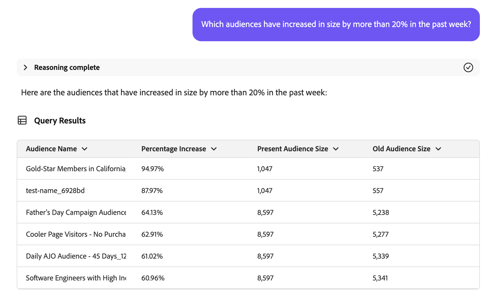

# Audience Agent

>[!AVAILABILITY]
>
>Audience Agent är tillgängligt för alla kunder som har tillgång till AI Assistant. Du behöver dock följande behörigheter för att kunna använda Audience Agent-funktionerna fullt ut.
>
>**Visa segment**: Med den här behörigheten kan du använda Audience Agent för att visa insikter om målgrupperna direkt i AI Assistant.
>&#x200B;>**Hantera segment**: Med behörigheten Till kan du använda Audience Agent för att skapa nya målgrupper direkt i AI Assistant.

Med Audience Agent kan ni visa insikter om målgrupper, inklusive att identifiera betydande förändringar i målgruppsstorlek, identifiera dubblerade målgrupper, utforska era målgruppslager och hämta era målgruppers storlek.

## Användningsexempel som stöds

Audience Agent i AI Assistant stöder följande användningsområden:

- Hitta målgruppens storlek och upptäcka betydande förändringar i målgruppens storlek
   - På så sätt kan ni hitta målgrupper som plötsligt har växt eller krympt, så att ni bättre kan analysera potentiella marknadsförändringar
- Identifiera duplicerade målgrupper
   - På så sätt kan ni minska redundansen hos era målgrupper
- Hitta målgrupper baserat på fullständiga eller partiella attribut
   - På så sätt kan ni enklare navigera i ert målgruppslager
- Upptäck XDM-fält som du kan använda för att definiera en målgrupp
   - Med den här kompetensen kan ni enklare identifiera rätt fält att använda i er målgrupp baserat på sammanhang och relevans

Audience Agent stöder för närvarande inte **för** följande funktioner:

- Kunskapsbaserad målgruppsproduktion
   - Kunskapsbaserade målgrupper skapar en målgrupp baserat på angivna attribut och händelser
   - Dessutom kan ni uppskatta målgruppens potentiella storlek innan ni skapar målgrupper. På så sätt kan ni snabbt iterera på den mest effektiva målgruppen innan den är redo att aktiveras
   - Stöd för den här funktionen kommer snart
- Målbaserad målgruppsundersökning
   - Målbaserad målgruppsundersökning gör att ni kan identifiera relevanta datauppsättningar och profiler som anpassats till ett affärsmål genom att tillämpa maskininlärningsmodeller som benägenhet att köpa eller konvertera.

När du använder Audience Agent bör du dessutom tänka på följande begränsningar:

- Audience Agent behöver minst 24 timmar för att bearbeta dina data
   - Du **kan till exempel inte** ha en fråga som söker efter data inom de senaste 24 timmarna. Du måste titta inom de senaste 48 timmarna, åtminstone.
- Audience Agent stöder bara **personer**-baserade målgrupper som utvärderas med gruppsegmentering

## Exempeluppmaningar

I följande exempel visas exempelfrågor och svar för Audience Agent.

### Utforska konversationsmålgrupper

Visa fält för välbärgade köpare.

+++ Svar

+++

Vilka målgrupper har inte aktiverats eller använts i någon kampanj de senaste 30 dagarna?

+++ Svar

+++

Lista alla målgrupper som har mappats till nya mål de senaste tre månaderna.

+++ Svar

+++

### Identifiera duplicerade målgrupper

Har jag någon publik med identiska eller liknande beskrivningar?

+++ Svar

+++

Identifiera målgrupper som har samma regler men olika namn.

+++ Svar

+++

Visa alla målgrupper som har samma regler men olika aktiveringsmål.

+++ Svar

+++

### Hämta målgruppsstorlek

Vilken är den nuvarande storleken på min publik&quot;Gold-star Members in California_f153e1&quot;?

+++ Svar

+++

Vilken är min största publik?

+++ Svar

+++

### Upptäck betydande förändringar i målgruppens storlek

Vilka målgrupper har ökat med över 20 % under den senaste veckan?

+++ Svar

+++

Vilka målgrupper har minskat med över 10 % den senaste månaden?

+++ Svar

+++

Vilken är min snabbast växande publik?

+++ Svar

+++

## Nästa steg

När du har läst den här guiden bör du få en bättre förståelse för Audience Agent och vilka funktioner den stöder. Mer information om agenter i Adobe Experience Platform finns i [Agent Orchestrator-översikten](./agent-orchestrator.md).
