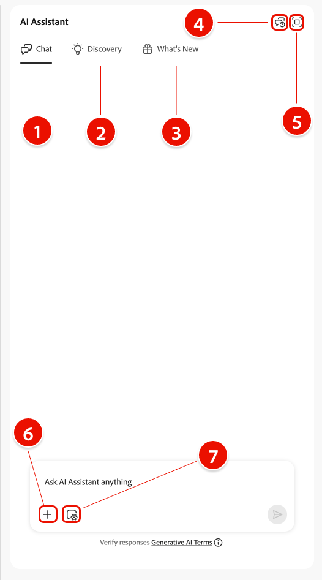
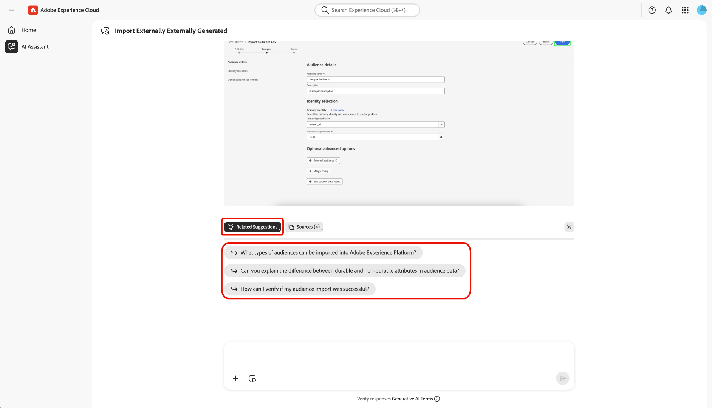
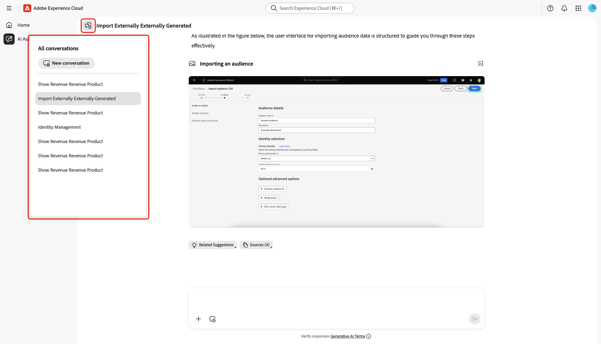

# AI-assistenten

AI Assistant är ett intelligent, generativt AI-verktyg för konversationer som ökar produktiviteten och omdefinierar arbetet i Adobe Experience Platform-baserade program. Du kan använda AI Assistant för att komma åt Adobe Experience Platform Agents och andra AI-funktioner.

Läs den här guiden och lär dig hur du kan använda AI Assistant.

>[!SLIDE](agent-orchestrator-ui)

## Få tillgång till AI-assistenten

Det finns flera sätt att få åtkomst till AI-assistenten.

I Experience Cloud hemgränssnitt väljer du **[!UICONTROL AI Assistant]** i den vänstra navigeringen för att starta en helskärmsvisning av AI Assistant.

+++Välj att visa

+++

Du kan även starta AI Assistant från startsidorna för Experience Cloud-program som Experience Platform, Adobe Journey Optimizer och Customer Journey Analytics. Navigera till din produkts hemsida och välj sedan ikonen **AI Assistant** i det övre huvudet för att öppna AI Assistant-chattpanelen i det högra fältet.

+++Välj att visa

+++

## Navigera i AI Assistant-användargränssnittet

Läs det här avsnittet om du vill veta mer om hur du kan navigera i gränssnittet för AI-assistenten.

### Helskärmsläge

Gränssnittet för AI-assistenten innehåller flera viktiga element som hjälper dig att interagera effektivt:

1. **[!UICONTROL Conversations]**: Välj ikonen **[!UICONTROL Conversations]** om du vill starta en ny konversation och komma åt de senaste konversationerna från din historik. Mer information finns i avsnittet om [konversationer](#conversations).
2. **Inmatningsruta**: Markera inmatningsrutan för att ange frågor och uppmaningar för AI Assistant. Mer information finns i avsnittet om [indatafunktioner](#input-features).
3. **Komplettera data och objekt automatiskt**: - Välj plusikonen om du vill använda data och objektförslag och fylla i automatiskt. När det här alternativet är markerat kan du använda ett popup-fönster för att välja föreslagna enheter. Mer information finns i avsnittet om [data och objekt som slutförs automatiskt](#autocomplete).
4. **Kontextinställning**: - Välj kontextinställningsikonen för att konfigurera informationskällor för AI-assistenten. Du kan använda det här verktyget för att konfigurera programmet, sandlådan och datavyn som AI Assistant refererar till för att svara på din fråga. Mer information finns i avsnittet om [kontextinställning](#context-setting).
5. **Identifiering**: - Välj **[!UICONTROL Learn]**, **[!UICONTROL Analyze]** och **[!UICONTROL Optimize]** om du vill visa exempelfrågor som du kan använda för att komma igång. Mer information finns i avsnittet om [frågor om upptäckbarhet](#discoverability-prompts).

### Vyn Järnväg

I spårvyn får du snabb åtkomst till chatt, sökningar, uppdateringar, konversationer och gränssnittskontroller via en kompakt panel.

1. **[!UICONTROL Chat]**: Välj **[!UICONTROL Chat]** i rubriken om du vill återgå till konversationen om du skulle lämna den för att komma åt olika element i gränssnittet.
1. **[!UICONTROL Discovery]**: Välj **[!UICONTROL Discovery]** om du vill visa en lista över AI Assistant-uppmaningar ordnade efter kategori. Du kan använda dessa förkonfigurerade uppmaningar för att fylla i din chatt. Dessutom kan du ändra de föreslagna anvisningarna så att de passar ditt eget användningssätt.
1. **[!UICONTROL What's New]**: Välj **[!UICONTROL What's New]** om du vill visa en lista över de senaste uppdateringarna som är tillgängliga för AI Assistant.
1. **[!UICONTROL Conversations]**: Välj ikonen **[!UICONTROL Conversations]** om du vill starta en ny konversation och komma åt de senaste konversationerna från din historik. Mer information finns i avsnittet om [konversationer](#conversations).
1. **Helskärmsläge**: Välj ikonen **[!UICONTROL Full screen view]** om du vill ändra AI Assistant-gränssnittet från den högra listen till helskärmsläge.
1. **Komplettera data och objekt automatiskt**: Markera plusikonen om du vill använda data- och objektförslag och fylla i automatiskt. När det här alternativet är markerat kan du använda ett popup-fönster för att välja föreslagna enheter. Mer information finns i avsnittet om [data och objekt som slutförs automatiskt](#autocomplete).
1. **Kontextinställning**: Välj kontextinställningsikonen för att konfigurera informationskällor för AI-assistenten. Du kan använda det här verktyget för att konfigurera programmet, sandlådan och datavyn som AI Assistant refererar till för att svara på din fråga. Mer information finns i avsnittet om [kontextinställning](#context-setting).

## Användargränssnittshandbok för AI Assistant

I det här avsnittet finns en översikt över de viktigaste funktionerna och navigeringsalternativen i AI Assistant-gränssnittet. Där beskrivs hur du får tillgång till AI Assistant, hur du arbetar med layout och kontroller i både helskärmsläge och på räls. Här presenteras även viktiga verktyg som konversationer, inmatningsfunktioner, automatisk komplettering, kontextinställningar och sökningsfrågor. I följande avsnitt ges detaljerad vägledning om hur du använder dessa funktioner för att interagera med AI Assistant och få ut så mycket som möjligt av din upplevelse.

### Identifieringsfrågor

Du kan använda AI Assistants identifieringsfunktion för att visa en lista över allmänna ämnen, grupperade i entiteter, som AI Assistant stöder. Identifieringsprompterna varierar beroende på startpunkten.

>[!BEGINTABS]

>[!TAB Använd identifiering från helskärmsvyn]

Identifieringsuppmaningar grupperas i tre kategorier från helskärmsvyn: **[!UICONTROL Learn]**, **[!UICONTROL Analyze]** och **[!UICONTROL Optimize]**.

Om du vill använda identifieringsuppmaningar för att förbättra produktkunskapen väljer du **[!UICONTROL Learn]** och väljer sedan en uppmaning i listrutan som visas.

>[!TAB Använd identifiering från spårningsvyn]

Välj **[!UICONTROL Discovery]** från spårningsvyn för att få tillgång till en omfattande lista med identifieringsfrågor som du kan använda för att komma igång och fylla i din chatt med AI Assistant.

>[!ENDTABS]

Välj en uppmaning om att fylla i inmatningsrutan. Här kan du redigera uppmaningen så att den passar ditt sätt att arbeta. När du är klar väljer du skicka-ikonen till höger för att skicka din fråga.

## Interagera med svar

### Kontrollera om det finns en logikprocess {#reasoning}

AI Assistant frågar sedan efter sin kunskapsbas och beräknar ett svar. Efter en liten stund returnerar AI Assistant ett svar, inklusive alternativ för att fördjupa sig i tankeprocessen, relaterade förslag, informationskällor och feedbackverktyg.

Välj **[!UICONTROL Reasoning complete]** om du vill få en bättre förståelse för den underliggande argumenteringsprocessen.

Fönstret *[!UICONTROL Reasoning complete]* utökas så att det visas en sammanfattning av din begäran och information om hur svaret skapades.

### Använd relaterade förslag

Gå sedan ned till svarets nedre del och välj **[!UICONTROL Related suggestions]** för att få en lista över frågor som är relaterade till den inledande frågan. Du kan fortsätta konversationen med AI Assistant med hjälp av de här anvisningarna.

### Visa källor

Om du vill verifiera AI Assistants svar väljer du **[!UICONTROL Sources]** för att visa en lista över informationskällor som AI Assistant refererade till när svaret beräknades.

### Ge feedback

Du kan ge återkoppling om din upplevelse med AI Assistant med hjälp av alternativen i svaret.

Om du vill ge feedback väljer du antingen tummen uppåt eller tummen nedåt när du fått ett svar från AI Assistant och anger sedan din feedback i textrutan.

>[!BEGINTABS]

>[!TAB Tummen uppåt]

Välj **[!UICONTROL Thumbs up]** om du vill ge positiv feedback. Du kan också välja från en lista med positiv feedback eller använda inmatningsrutan för att ange egen specifik feedback.

+++Välj att visa

Du kan också välja **[!UICONTROL Detailed feedback]** om du vill gå vidare med din feedback. När du är klar väljer du **[!UICONTROL Submit]**.

+++

>[!TAB Tummen nere]

Välj **[!UICONTROL Thumbs down]** om du vill ge konstruktiv feedback. Du kan också välja från en lista med konstruktiv feedback eller använda inmatningsrutan för att ange din egen specifika feedback.

+++Välj att visa

På samma sätt kan du även välja **[!UICONTROL Detailed feedback]** för att ytterligare gå igenom din feedback. När du är klar väljer du **[!UICONTROL Submit]**.

+++

>[!ENDTABS]

### Använda funktionen för delad vy

Om AI-assistentens svar innehåller en bild kan du välja banikonen för att starta ett delvisningsläge. På så sätt kan du läsa hela AI Assistants svar med en sammanhangsberoende bild till höger.

### Konversationer

Du kan använda panelen *[!UICONTROL All conversations]* för att återställa och gå igenom konversationer med AI Assistant. Välj ikonen **[!UICONTROL Conversations]** om du vill visa fönstret *[!UICONTROL All conversations]*.

Om du vill återuppta en tidigare konversation väljer du konversationsämnet i listan.

Välj **[!UICONTROL New conversation]** om du vill starta en ny konversation.

### Kontextinställning {#context-setting}

Använd kontextinställningsfunktionen i AI Assistant för att konfigurera AI Assistant-referenserna för **programmet**, **sandlådan** och **datview** som AI Assistant refererar till för att svara på din fråga. Om du vill komma åt en kontextinställning väljer du ikonen **[!UICONTROL Context setting]** i indatarutan.

Popup-fönstret *[!UICONTROL Answer from...]* visas. Använd det här fönstret för att konfigurera de informationskällor som du vill använda och välj sedan **[!UICONTROL Set context]**.

| Informationskälla | Beskrivning | Exempel |
| --- | --- | --- |
| App | Det Experience Cloud-program som frågan gäller. | Experience Platform, Journey Optimizer, Customer Journey Analytics osv. |
| Sandbox | Sandlådan som innehåller de datauppsättningar eller den information som frågan gäller. | Prod (VA7), dev. |
| Datavy | När du använder AI Assistant med Customer Journey Analytics hjälper datavyn Data Insights Agent att förstå: <ul><li>Vilka datauppsättningar som ska frågas</li><li>Vilka datakomponenter som finns tillgängliga</li><li>Strukturera svaren om era data</li><li>Vilka visualiseringar som ska skapas i Analysis Workspace</li></ul> |

### Komplettera data och objekt automatiskt

Du kan använda funktionen för automatisk komplettering för att ta emot en lista med dataobjekt som finns i din sandlåda. Om du vill använda Fyll i automatiskt anger du plusikonen (+) i frågan. Du kan också välja plusikonen (+) längst ned i textinmatningsrutan. Ett fönster visas med en lista över rekommenderade dataobjekt från sandlådan.

### Verifiera svar

Du kan verifiera svar från AI Assistant på flera olika sätt. Välj **[!UICONTROL Query Term Matched to Objects]** om du vill visa en sammanfattning av de termer i frågan som matchades mot specifika objekt i organisationen.

Välj **[!UICONTROL Here is how I got the results]** om du vill se en detaljerad, stegvis förklaring av hur AI Assistant kom fram till sitt svar. Dessutom kan du visa den SQL-fråga som kördes för att besvara din fråga. Frågan är skrivskyddad och stöds inte för användning i frågetjänsten.

### Konfigurera datavisualisering

Du kan använda AI Assistants datavisualiseringsfunktioner för att få en bättre förståelse för dina data. Du kan också ange vilken typ av diagram du vill använda i frågan. Skicka till exempel en fråga som säger: **&quot;Visa vinst efter produktnamn för förra månaden (stapel)&quot;** för att få ett diagram över vinst under den senaste månaden, sorterat efter produktnamn.

Välj sedan **[!UICONTROL Properties]** om du vill ändra diagramtypen och konfigurera värden för X- och Y-axeln.

AI Assistant stöder flera diagramtyper för datavisualisering. Du kan interagera med alla typer av diagram genom att hålla markören över data.

>[!BEGINTABS]

>[!TAB Rad]

Om du vill visa ett linjediagram väljer du **[!UICONTROL Properties]** och sedan **[!UICONTROL Line]**.

>[!TAB Område]

Om du vill visa ett ytdiagram väljer du **[!UICONTROL Properties]** och sedan **[!UICONTROL Area]**.

>[!TAB Spridning]

Om du vill visa ett punktdiagram väljer du **[!UICONTROL Properties]** och sedan **[!UICONTROL Scatter]**.

>[!TAB Ring]

Markera **[!UICONTROL Properties]** och välj sedan **[!UICONTROL Donut]** om du vill visa ett strängdiagram.

>[!ENDTABS]
